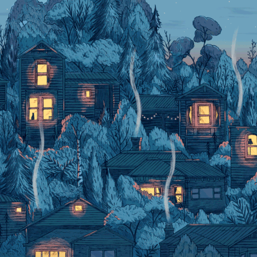

<!-- 🦀 Giuseppe Saluto - GitHub Profile README -->

   

---

<h1 align="center">🦀 Hey there, I'm Giuseppe Saluto</h1>

  <strong>🛠️ Build! 🔗 Collaborate! ⚙️ Automate!</strong>

  <em>Software Developer passionate about crafting reliable, efficient, and scalable systems that make technology work smarter.</em>

---

### 🧭 About Me

💡 I’m a **software developer** with a strong focus on **Python (Flask)** and **Rust**, passionate about designing robust back-end architectures and automated systems.  
🦀 I’m currently deepening my journey as a **Rustacean**, actively contributing to projects and exploring the Rust ecosystem.  
⚙️ I enjoy building **scalable B2B platforms**, designing **RESTful APIs**, and working with tools like **Docker** and **Linux** to automate development workflows.  
🚀 I believe in continuous learning, clear code, and building solutions that are as elegant as they are efficient.

---

### 🧰 Languages & Tools

  
  
  
  
  
  
  
  
  
  

---

### 🧑‍💻 Coding Journey

  
📖 Click to read more

  My journey into software development started from a fascination with how **automation and clean design** can improve people’s workflows.  
  Over time, I’ve specialized in building **reliable APIs**, **microservices**, and **scalable systems** — mostly using **Python** and **Rust**.  

  I’m deeply interested in **performance-oriented programming**, **DevOps practices**, and the art of writing **minimal, expressive code**.  
  Every new challenge is an opportunity to learn something new — whether it’s mastering Rust’s ownership model or optimizing containerized deployments with Docker.

  Currently, I’m:
  - 🦀 Expanding my Rust expertise  
  - ⚙️ Building side projects with Python or Rust  
  - 📚 Exploring system-level programming and backend optimizations  
  - 🤝 Open to collaborations on open-source projects  

---

### 📊 GitHub Stats

  
  

  

---

### 📫 Connect With Me

  
  &nbsp;&nbsp;&nbsp;
  
  &nbsp;&nbsp;&nbsp;
  
  &nbsp;&nbsp;&nbsp;
  

---

### ⚡ Fun Fact
When I’m not coding, you’ll probably find me playing video games 🎮, exploring fantasy and sci-fi worlds, or optimizing something that probably didn’t need optimizing 😄  

---